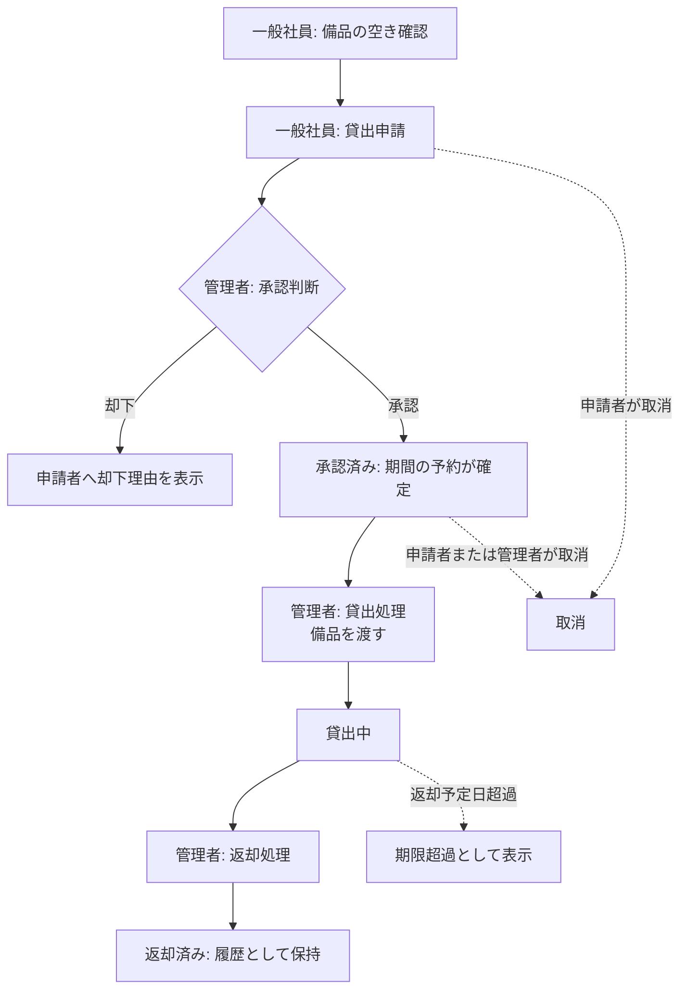

# 業務要件

- **工程**: 要件定義工程
- **作成者**: Claude Sonnet 5
- **作成日**: 2026-09-26
- **最終更新日**: 2026-09-26

---

## 対象業務
| 業務 | 担当者 | 業務上必要なこと |
|---|---|---|
| 備品の貸出申請 | 一般社員 | 備品の空き状況を確認し、貸出期間を指定して申請する |
| 申請の承認・却下 | 管理者 | 申請内容・備品の空きを確認し、承認または却下する（却下時は理由を記録） |
| 備品の貸出 | 管理者 | 承認済みの申請について、備品を渡した事実を記録する |
| 備品の返却受付 | 管理者 | 備品の返却を受け、返却日時・状態メモを記録する |
| 期限超過の把握 | 管理者・一般社員 | 返却予定日を過ぎた貸出を把握し、返却を促す |
| 備品・ユーザーの管理 | 管理者 | 備品マスタ・社員アカウントを登録・更新・無効化する |

## 業務の流れ

## 利用状況
- 利用者数：一般社員約50人、管理者1〜3人。
- 備品数：数百点。
- 利用場所・環境：社内LANに接続した社内端末のWebブラウザ。社外からの利用は対象外。
- 発生頻度：平日の業務時間帯（9:00〜18:00）が中心。1日あたりの申請件数は数件〜数十件を想定（運用開始後に実績で見直す）。

## 成功基準

| 指標 | 目標値 |
|---|---|
| 二重貸出（同一備品・同一期間の重複承認）の発生 | 0件 |
| 貸出中の備品の現在の借用者・返却予定日を確認できること | 全備品で確認可能 |
| 貸出・返却の記録が履歴として残ること | 全貸出で100%（削除しない） |
| 期限超過の貸出を一覧で把握できること | 管理者が1画面で把握可能 |

## 対象範囲
- 対象：備品の個体管理、貸出申請・承認・貸出・返却、将来日の予約、期限超過の表示、備品・ユーザー管理、貸出履歴のCSV出力、備品マスタのCSV一括登録。
- 対象外：貸出期間の延長申請、数量管理（消耗品等）、メール・チャットツール等の外部通知、社内SSO連携、備品写真のアップロード、社外からのアクセス、備品の購入・廃棄・棚卸し・修理の業務管理。

## 前提・制約
- 社内LAN内のサーバーで運用し、外部サービスとは連携しない。
- 認証は本システム独自のID・パスワードとする（社内SSOは使用しない）。
- 貸出履歴・申請履歴は削除しない。備品・ユーザーは論理削除（無効化）とする。
- 予算・期間の制約は現時点で未指定（無し）。
