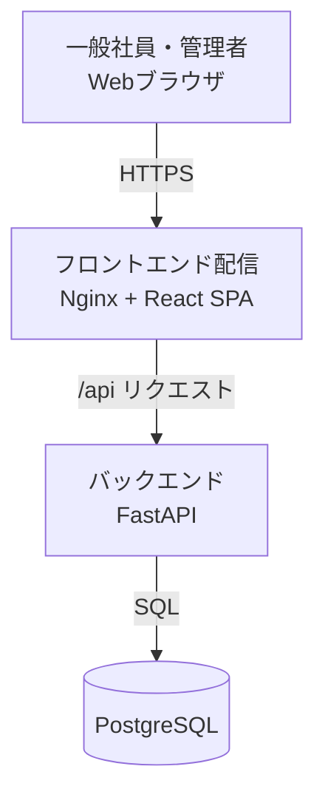

# 概要

- **工程**: 要件定義工程
- **作成者**: Claude Sonnet 5
- **作成日**: 2026-09-26
- **最終更新日**: 2026-09-26

---

## 目的
- 社内の備品（ノートPC・プロジェクター・周辺機器等）の貸出を、紙・口頭・表計算ソフトではなくWebアプリで一元管理する。
- 達成後の状態：社員がWeb上で備品の空き状況を確認して貸出を申請でき、管理者が承認・貸出・返却を記録し、「誰が・どの備品を・いつまで借りているか」を常に把握できる。

## 背景・課題
- 現状は備品ごとの貸出状況の把握が属人的で、二重貸出・返却漏れ・期限超過の把握漏れが起きうる（利用者の運用実態は業務要件で確定する）。
- 貸出履歴が残らないため、備品の所在確認や利用実績の集計ができない。

## 想定利用者
| 利用者 | 立場 |
|---|---|
| 一般社員（一般利用者） | 備品の空き確認・貸出申請・自分の申請/貸出状況の確認を行う。約50人 |
| 管理者 | 備品担当者。申請の承認・却下、貸出・返却の記録、備品・ユーザー・貸出履歴の管理を行う。少数（1〜3人程度を想定） |

## システム構成
- 社内LAN内のサーバー1台にDocker Composeで配置する。利用者は社内端末のWebブラウザからアクセスする。

## 用語
| 用語 | 説明 |
|---|---|
| 備品 | 貸出対象の物品。1点ずつ資産番号で個体管理する |
| 資産番号 | 備品1点ごとに一意に付与する管理番号 |
| 貸出申請 | 一般社員が備品・貸出期間を指定して行う申請 |
| 承認 | 管理者が貸出申請を許可すること（貸出の予約が確定する） |
| 貸出 | 管理者が備品を申請者へ実際に渡したことを記録すること |
| 返却 | 管理者が備品の返却を受けたことを記録すること |
| 期限超過 | 貸出中の備品が返却予定日を過ぎても返却されていない状態 |
| 無効化 | 論理削除。データを削除せず利用不可にすること |
