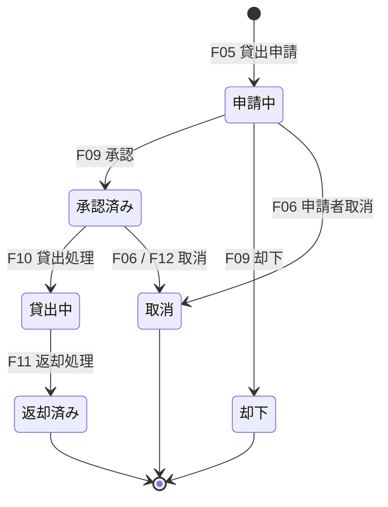

# 機能要件

- **工程**: 要件定義工程
- **作成者**: Claude Sonnet 5
- **作成日**: 2026-09-26
- **最終更新日**: 2026-09-26

---

## アクセス制御
- 認証方式：ユーザーID・パスワードによるログイン。認証後はトークンを発行し、以降のAPIで検証する（方式の詳細は判断根拠書No.4）。
- ロールは「一般」「管理者」の2種類。管理者は一般の操作もすべて行える。

| 機能 | 認証 | 一般 | 管理者 | データ範囲 |
|---|---|---|---|---|
| F01 ログイン・ログアウト | ログインのみ不要 | ○ | ○ | 自分のみ |
| F02 パスワード変更 | 必要 | ○ | ○ | 自分のみ |
| F03 備品検索・一覧表示 | 必要 | ○ | ○ | 全備品（無効化済み備品は管理者のみ） |
| F04 備品の予約状況確認 | 必要 | ○ | ○ | 期間・状態のみ表示（借用者名は管理者のみ） |
| F05 貸出申請 | 必要 | ○ | ○ | 自分名義のみ |
| F06 申請取消 | 必要 | ○ | ○ | 自分の申請のみ |
| F07 自分の申請・貸出状況確認 | 必要 | ○ | ○ | 自分の申請のみ |
| F08 通知確認 | 必要 | ○ | ○ | 自分宛のみ |
| F09 申請承認・却下 | 必要 | × | ○ | 全申請 |
| F10 貸出処理 | 必要 | × | ○ | 全申請 |
| F11 返却処理 | 必要 | × | ○ | 全貸出 |
| F12 申請の管理者取消 | 必要 | × | ○ | 全申請 |
| F13 期限超過一覧確認 | 必要 | × | ○ | 全貸出 |
| F14 備品登録・編集・無効化 | 必要 | × | ○ | 全備品 |
| F15 備品CSV一括登録 | 必要 | × | ○ | 全備品 |
| F16 ユーザー登録・編集・無効化 | 必要 | × | ○ | 全ユーザー |
| F17 貸出履歴閲覧・CSV出力 | 必要 | × | ○ | 全履歴 |

- 認可エラー時：未認証は認証エラー（401）、権限不足は権限エラー（403）とする。他人の申請への操作は、存在有無を判別できないよう「対象なし」と同様に扱う。

---

## 業務ルール
### 申請・予約
- 申請の状態は「申請中」「承認済み」「貸出中」「返却済み」「却下」「取消」の6種類。状態遷移は次のとおり。

- 「期限超過」は状態ではなく、状態が「貸出中」かつ返却予定日が今日より前であることから算出する。
- 貸出期間は開始日・返却予定日（日単位）で指定する。開始日は今日以降、返却予定日は開始日以降とする（貸出期間の上限は設けない）。
- 将来日の予約を許可する（貸出期間・予約可能な先の日付に上限は設けない）。
- 同一備品について、状態が「承認済み」「貸出中」の申請の期間が重複する申請は承認できない（二重貸出の防止）。申請時に、承認済み・貸出中の期間と重複する場合はエラーとする。承認時にも重複を再検証する（申請から承認までの間に別の予約が承認されうるため）。申請中同士の期間重複は許可する（先に承認された方が有効）。
- 期間の重複判定は、開始日〜返却予定日の両端を含む日単位で行う。
- 貸出中の備品は、返却処理が行われるまで、返却予定日を過ぎても期間が占有されたままとみなす（後続の予約は承認できない）。
- 一般社員1人あたりの同時申請件数に上限は設けない。
- 承認済みの申請が開始日を過ぎても貸出処理されない場合は、申請を自動的に取消とする（ノーショー対策）。

### 貸出・返却
- 貸出処理（F10）は、承認済みで開始日が今日以前の申請に対してのみ行える（開始日前の貸出処理は不可）。
- 貸出処理は、その備品が無効化されておらず、貸出中の別申請が存在しない場合のみ行える。
- 返却処理（F11）は、貸出中の申請に対してのみ行える。返却日時はサーバー時刻を自動記録し、状態メモ（任意、故障・破損等）を残せる。
- 返却が実際の返却予定日より遅れた場合も、返却は通常どおり記録する（遅延日数は履歴で確認できる）。

### 備品・ユーザー
- 備品は資産番号で一意に識別する。資産番号の重複登録はエラーとする。
- 備品を無効化する場合、その備品に「申請中」「承認済み」「貸出中」の申請があるときは無効化できない（先に取消または返却が必要）。
- 無効化済み備品は、新規の貸出申請の対象外とする。過去の履歴には残る。
- ユーザーIDは重複登録不可とし、無効化済みユーザーのIDも再利用不可とする。
- 無効化済みユーザーはログインできない（認証エラーとして扱う）。無効化時、そのユーザーの「申請中」「承認済み」の申請は自動的に取消とする。「貸出中」の申請があるユーザーは無効化できない（先に返却が必要）。
- 最後の有効な管理者を、無効化またはロールを一般に変更することはできない。
- パスワードは8文字以上とする（判断根拠書No.6）。ユーザー登録時・パスワード初期化時に管理者が設定した初期パスワードは、初回ログイン時に変更を必須とする。

### 通知（アプリ内）
- 通知は次の場合に、対象者宛に生成する。
    - 申請が承認・却下・管理者取消されたとき → 申請者宛
    - 新しい申請が行われたとき → 全管理者宛（承認待ちの件数として表示）
    - 貸出中の返却予定日の前日および期限超過中 → 借用者宛
- 通知は画面上での表示のみ。既読にできる。

### 自動生成・自動計算される値
- 申請ID・備品ID・ユーザーIDの内部ID：システムが連番で自動採番する（グローバル採番）。
- 申請の状態遷移日時（申請日時・承認日時・貸出日時・返却日時）：サーバー時刻を自動記録する。
- 期限超過日数：今日 − 返却予定日（貸出中のとき）。

---

## 扱うデータ
- 個人情報：ユーザーの氏名・ユーザーID・所属（任意項目）を扱う。利用目的は備品貸出の管理のみ。保持期間は、貸出履歴の追跡のため無期限とする（論理削除のみ。物理削除は行わない）。
- 貸出履歴・申請履歴は削除しない。ユーザー・備品の無効化後も履歴は保持し、履歴上は無効化済みの氏名・備品名をそのまま表示する。

### ユーザー
| 項目 | 型 | 制限 | 必須 | デフォルト・備考 |
|---|---|---|---|---|
| 内部ID | 整数 | 自動採番 | ○ | グローバルな連番 |
| ユーザーID | 文字列 | 3〜32文字、半角英数字と`_`・`-` | ○ | 重複不可。無効化後も再利用不可 |
| 氏名 | 文字列 | 1〜50文字 | ○ | |
| 所属 | 文字列 | 0〜50文字 | 任意 | 空 |
| パスワードハッシュ | 文字列 | Argon2idハッシュ | ○ | 平文は保存しない |
| ロール | 列挙 | 一般 / 管理者 | ○ | 一般 |
| 有効フラグ | 真偽 | | ○ | 有効（無効化=論理削除） |
| 初回パスワード変更要否 | 真偽 | | ○ | 要（登録時・初期化時） |
| 作成日時・更新日時 | 日時 | | ○ | サーバー時刻 |

### 備品
| 項目 | 型 | 制限 | 必須 | デフォルト・備考 |
|---|---|---|---|---|
| 内部ID | 整数 | 自動採番 | ○ | |
| 資産番号 | 文字列 | 1〜32文字、半角英数字と`-` | ○ | 重複不可 |
| 備品名 | 文字列 | 1〜100文字 | ○ | |
| 分類 | 文字列 | 1〜50文字 | ○ | 自由入力（分類マスタは設けない） |
| 説明 | 文字列 | 0〜500文字 | 任意 | 空 |
| 保管場所 | 文字列 | 0〜100文字 | 任意 | 空 |
| 有効フラグ | 真偽 | | ○ | 有効（無効化=論理削除） |
| 作成日時・更新日時 | 日時 | | ○ | サーバー時刻 |

### 貸出申請（貸出履歴を兼ねる）
| 項目 | 型 | 制限 | 必須 | デフォルト・備考 |
|---|---|---|---|---|
| 内部ID | 整数 | 自動採番 | ○ | |
| 備品ID | 整数 | 備品への参照 | ○ | |
| 申請者ユーザーID | 整数 | ユーザーへの参照 | ○ | |
| 開始日 | 日付 | | ○ | |
| 返却予定日 | 日付 | | ○ | |
| 用途 | 文字列 | 1〜200文字 | ○ | |
| 状態 | 列挙 | 申請中/承認済み/貸出中/返却済み/却下/取消 | ○ | 申請中 |
| 却下・取消理由 | 文字列 | 0〜200文字 | 却下・管理者取消時は必須 | 空 |
| 処理した管理者 | 整数 | ユーザーへの参照 | 任意 | 承認・貸出・返却時に記録 |
| 申請日時・承認日時・貸出日時・返却日時 | 日時 | | 状態に応じて記録 | 未到達の状態は空 |
| 返却時状態メモ | 文字列 | 0〜200文字 | 任意 | 空 |

### 通知
| 項目 | 型 | 制限 | 必須 | デフォルト・備考 |
|---|---|---|---|---|
| 内部ID | 整数 | 自動採番 | ○ | |
| 宛先ユーザーID | 整数 | ユーザーへの参照 | ○ | |
| 種別 | 列挙 | 承認/却下/取消/新規申請/返却期限 | ○ | |
| 関連申請ID | 整数 | 申請への参照 | ○ | |
| 既読フラグ | 真偽 | | ○ | 未読 |
| 作成日時 | 日時 | | ○ | サーバー時刻 |

### 関連データ削除時の動作
- 物理削除は行わない。ユーザー・備品を無効化しても、それに紐づく申請・通知は保持する（連鎖削除しない）。

---

## ファイル入出力
| 機能 | 種別 | 形式 | 条件 |
|---|---|---|---|
| F15 備品CSV一括登録 | 入力 | CSV（UTF-8、ヘッダー行あり、列は資産番号・備品名・分類・説明・保管場所） | 最大5MB・最大1,000行。全行を検証し、1行でもエラーがあれば全件登録しない（行番号付きでエラーを表示）。資産番号の重複はエラー。ファイル名はサーバーで使用しない |
| F17 貸出履歴CSV出力 | 出力 | CSV（UTF-8 BOM付き。Excelでの文字化けを避けるため） | 期間・備品・借用者で絞り込んだ結果を出力。セルの先頭が`=`・`+`・`-`・`@`の場合は数式として実行されないよう無害化する |

---

## 外部連携
- 無し（メール・チャットツール・社内SSO・他システムとの連携は行わない）。
