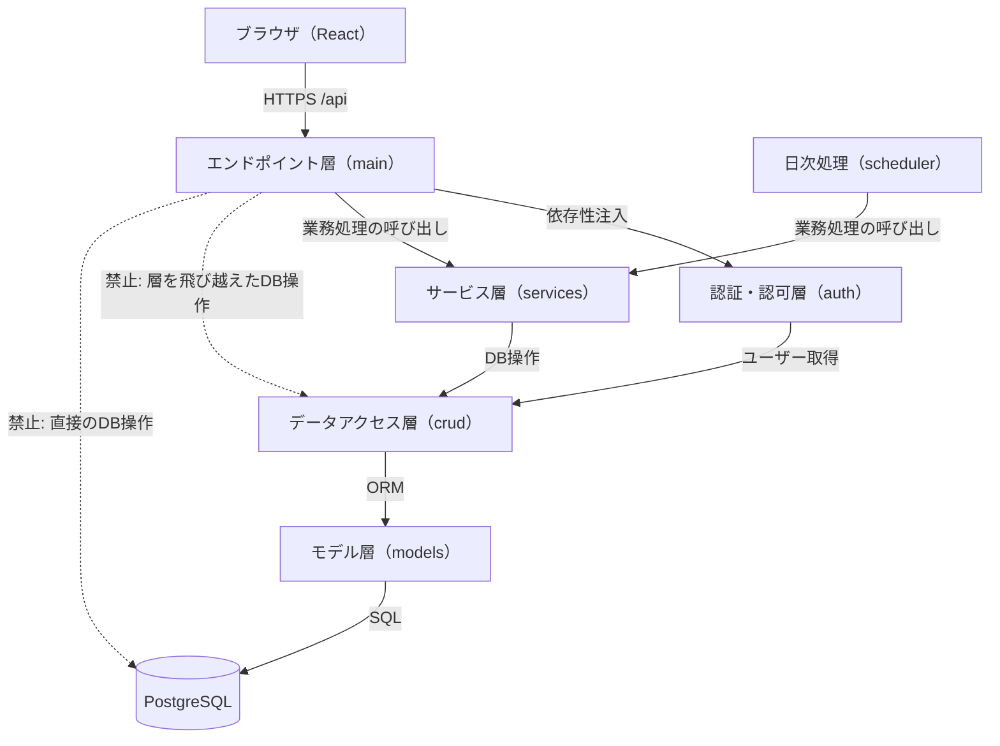

# アーキテクチャ方針

- **工程**: 設計工程
- **作成者**: Claude Sonnet 5
- **作成日**: 2026-09-26
- **最終更新日**: 2026-09-26

---

## 概要

### 目的
- バックエンドの層構成・責務・共通ルールを定め、全機能群で一貫した設計・実装を行えるようにする。
- 個別メソッドの処理内容は各処理記述書に記載し、ここには重複させない。

### 対象範囲
- `backend/app/`配下の全モジュール（main・services・auth・crud・models・schemas・database・scheduler）。
- フロントエンドの構成は対象外（UI仕様書・実装工程で扱う）。

---

## 構成

| 要素 | 役割 | 対応ファイル・ディレクトリ |
|---|---|---|
| エンドポイント層 | HTTPリクエストの受付・入力検証（Pydanticスキーマ）・認証認可の依存性注入・サービス層の呼び出し・レスポンス返却 | `backend/app/main.py` |
| サービス層 | 業務処理（状態遷移・期間重複判定・通知生成・トランザクション管理）のオーケストレーション | `backend/app/services.py` |
| 認証・認可層 | トークン発行・検証、パスワードハッシュ、現在ユーザー・ロールの検証 | `backend/app/auth.py` |
| データアクセス層 | DB操作関数（Create／Read／Update／Delete）。業務判断は持たない | `backend/app/crud.py` |
| モデル層 | SQLAlchemyのテーブルモデル | `backend/app/models.py` |
| スキーマ層 | リクエスト・レスポンス・共通型のPydanticスキーマ | `backend/app/schemas.py` |
| DB接続層 | エンジン・セッション生成 | `backend/app/database.py` |
| 日次処理 | 期限通知・ノーショー自動取消の起動定義（APScheduler） | `backend/app/scheduler.py` |

---

## ルール

### 層間の呼び出し

| No | ルール |
|---|---|
| 1 | エンドポイント層（main）は、業務処理をサービス層（services）へ委譲する。crudを直接呼び出さない（認証・認可層の依存性注入を除く） |
| 2 | データアクセス層（crud）は、業務判断（状態遷移の可否・権限判定等）を持たない。条件に合うレコードの取得・登録・更新のみを行う |
| 3 | 日次処理（scheduler）はサービス層のみを呼び出す |
| 4 | サービス層の関数の引数は、`Session`と業務上必要な値（スキーマまたはプリミティブ）とし、`Request`等のHTTP固有オブジェクトを渡さない |

### トランザクション・排他制御

| No | ルール |
|---|---|
| 1 | トランザクションの境界はサービス層の1関数（＝1業務処理）とする。正常終了時にサービス層が`commit`し、例外時は`rollback`する。crudは`commit`せず`flush`のみ行う |
| 2 | 同一備品に対する申請登録・承認・貸出処理は、備品レコードを`SELECT ... FOR UPDATE`で行ロックしてから期間重複・状態を検証する（二重貸出防止。非機能要件「整合性」） |
| 3 | 二重貸出はDB制約でも防止する（設計書「テーブル定義（models）」の`loan_request`「補足」参照）。制約違反（`IntegrityError`）は409として扱う |
| 4 | 複数レコードを更新する処理（ユーザー無効化に伴う申請の自動取消等）は、1トランザクションで行う |

### 日時・日付

| No | ルール |
|---|---|
| 1 | 日時（`DATETIME`）はUTCのタイムゾーン付きで保存する。日付（`DATE`：開始日・返却予定日）はJSTの暦日を保存する |
| 2 | 「今日」「開始日の翌日」等の日付判定は、サービス層の`今日取得`（JST）を用いる。現在日時は`現在日時取得`を用いる（どちらも業務処理内で直接`datetime.now()`を呼ばない。テスト時の差し替えを可能にする。定義は設計書「サーバー処理（main）/共通」の日時取得を参照） |
| 3 | API上の日時はISO 8601形式（JSTオフセット付き、例：`2026-09-26T14:05:00+09:00`）、日付は`YYYY-MM-DD`で返却する |

### 認証・認可

| No | ルール |
|---|---|
| 1 | APIは`/api`配下に配置する（Nginxが`/api`をバックエンドへ中継する）。ログイン・ヘルスチェック以外は、すべてBearerトークンを必須とする |
| 2 | 認証は依存性注入（`Depends`）で行う。認証・認可層は3種類の検証関数を提供する。下表（検証関数）のとおりエンドポイントごとに使い分ける |
| 3 | ユーザー無効化済み・トークン世代不一致・トークン期限切れ・署名不正は、すべて401（同一文言）とする |
| 4 | 管理者専用エンドポイントは、`管理者権限検証`を必ず注入する（画面の表示制御に依存しない）。権限不足は403とする |
| 5 | 他人の申請・通知に対する操作は、存在有無を判別できないよう、対象なし（404）と同じ応答にする |
| 6 | 初期パスワード（`must_change_password`が真）のユーザーは、`現在ユーザー取得`を使うエンドポイント（ログアウト・パスワード変更・自分の情報取得）以外を403とする |
| 7 | JWTはHS256・PyJWTで署名する。ペイロードは`sub`（ユーザー内部ID）・`gen`（トークン世代）・`iat`・`exp`（発行から8時間）とする。署名鍵は環境変数`JWT_SECRET_KEY`から取得する |

| 検証関数 | 物理名 | 検証内容 | 使用するエンドポイント |
|---|---|---|---|
| 現在ユーザー取得 | `get_current_user` | トークン・有効フラグ・トークン世代を検証する（初期パスワード状態でも通す） | ログアウト・パスワード変更・自分の情報取得 |
| 有効ユーザー検証 | `get_current_active_user` | 現在ユーザー取得に加え、初期パスワード未変更を拒否する | 上記以外の一般ユーザー向けエンドポイント |
| 管理者権限検証 | `get_current_admin_user` | 有効ユーザー検証に加え、管理者ロールを確認する | 管理者専用エンドポイント |

### エラー応答

| No | ルール |
|---|---|
| 1 | エラーは`HTTPException`で返却し、レスポンスボディは`{"detail": "<日本語メッセージ>"}`とする（スキーマ：`ErrorResponse`） |
| 2 | ステータスコードは下表のとおり用いる |
| 3 | エラーメッセージにSQL・スタックトレース・内部識別子・パスワード・トークンを含めない。想定外の例外は500「サーバーエラーが発生しました」を返し、詳細はサーバーログのみに記録する |
| 4 | Pydantic・FastAPIが自動返却する422は、`detail`を項目ごとのエラー一覧のまま返してよい（クライアントは画面側で日本語表示に変換する） |

| ステータス | 用途 |
|---:|---|
| 400 | 業務ルール違反（状態遷移不可・期間不正・重複登録等の、入力形式は正しいが業務上受け付けられない要求） |
| 401 | 認証エラー |
| 403 | 権限不足・初期パスワード未変更 |
| 404 | 対象なし（他人のデータへのアクセスを含む） |
| 409 | 競合（期間重複・DBの一意制約違反・同時操作による競合） |
| 422 | 入力値検証エラー（FastAPI自動返却） |
| 500 | 想定外のサーバーエラー |
| 503 | サービス利用不可（ヘルスチェックのDB接続失敗のみ） |

### ログ

| No | ルール |
|---|---|
| 1 | パスワード・トークン・ハッシュ・初期管理者情報をログに出力しない |
| 2 | 認証失敗・権限エラー・業務処理の失敗はサーバーログにユーザー内部ID・エンドポイント・結果を記録する（入力値そのものは記録しない） |

### DB・マイグレーション

| No | ルール |
|---|---|
| 1 | テーブルの物理名は小文字スネークケースとする。`USER`はPostgreSQLの予約語のため、ユーザーテーブルの物理名は`app_user`とする |
| 2 | スキーマ変更はAlembicで管理する。二重貸出防止の排他制約には`btree_gist`拡張が必要であり、初回マイグレーションで作成する |
| 3 | 初期管理者は、起動時に環境変数（`INITIAL_ADMIN_LOGIN_ID`・`INITIAL_ADMIN_PASSWORD`）から、管理者が1人も存在しない場合のみ自動作成する（初期パスワード変更要）。詳細は設計（認証・ユーザー管理）「初期管理者作成」 |

### 日次処理

| No | ルール |
|---|---|
| 1 | 日次処理は毎日6:00（JST）にAPScheduler（`BackgroundScheduler`）で実行する。バックエンドは1プロセス（uvicornのワーカー数1）で起動し、二重実行を防ぐ |
| 2 | 日次処理は冪等にする（同日に再実行しても、通知の重複生成・取消の再実行が起きない） |
| 3 | 日次処理の失敗は次回実行を妨げない（例外を捕捉してログに記録し、次回スケジュールを継続する） |

### 入出力の安全性

| No | ルール |
|---|---|
| 1 | SQLはSQLAlchemyのORM・バインドパラメータのみで実行し、文字列連結でSQLを組み立てない |
| 2 | CSV入力はサイズ・行数・形式を検証し、ファイル名をサーバー側で使用しない。CSV出力は先頭が`=`・`+`・`-`・`@`のセルを無害化する（先頭に`'`を付与する） |
| 3 | 一覧系エンドポイントは、件数が増える対象（貸出履歴・申請一覧・通知）にページング（共通スキーマ`PageQuery`）を用いる |

---

## 対応状況

| 区分 | 意味 |
|---|---|
| 共通 | 全機能群に適用する |
| 個別 | 特定の機能群にのみ適用し、当該機能群の設計書で詳細化する |

| 区分 | 対象 | 備考 |
|---|---|---|
| 共通 | 層構成・トランザクション・日時・認証認可・エラー応答・ログ・入出力安全性 | 本書のとおり |
| 個別 | ログイン失敗ロック・総当たり攻撃対策（IP単位のレート制限はNginx前段のため、一次防御はアカウントロック）・タイミングサイドチャネル対策・初期管理者作成・パスワード変更 | 設計（認証・ユーザー管理） |
| 個別 | 二重貸出防止の期間重複判定・状態遷移・自動取消 | 設計（貸出申請・承認）、設計（貸出・返却・履歴） |
| 個別 | CSV入出力・日次処理の詳細 | 設計（備品管理）、設計（貸出・返却・履歴） |

---

## 根拠・関連資料

- 判断根拠：要件定義書「判断根拠書」No.4（認証方式・トークン世代）、No.8（HTTPS）、No.9（技術スタック）、No.10（稼働環境）、No.14（二重貸出の防止ルール）。
- 本設計の設計判断：二重貸出の防止における行ロックとDB排他制約の併用、トークン有効期限の具体値（8時間。非機能要件「約8時間」に基づく）。
- 要件：要件定義書「非機能要件」（セキュリティ・整合性・運用・保守）、「機能要件」（アクセス制御・業務ルール）。
- 実装時に参照するルール：`運用ルール/開発ルール/セキュリティルール.md`。
